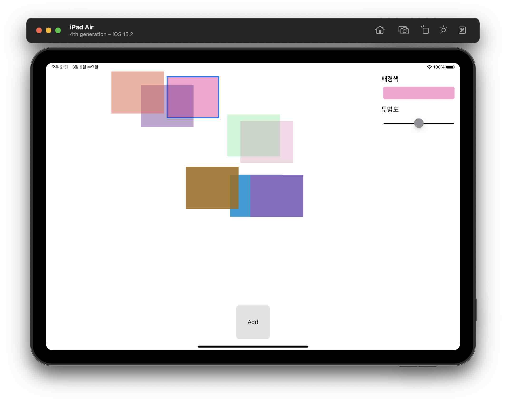
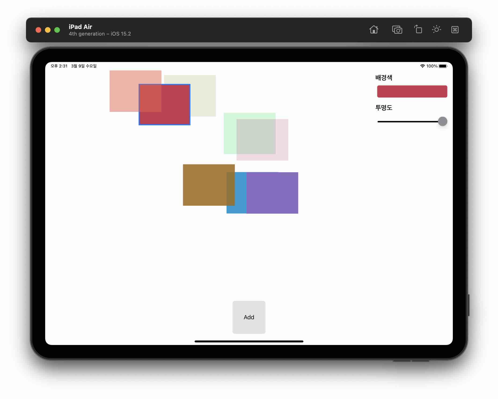
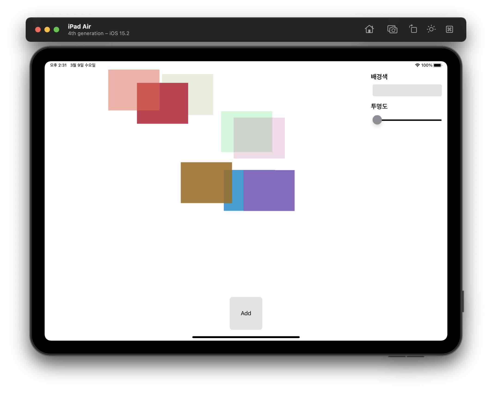
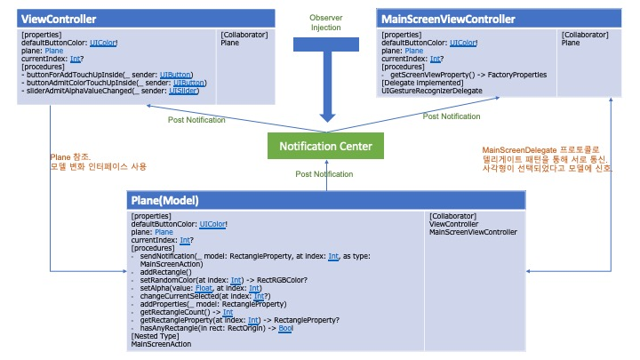
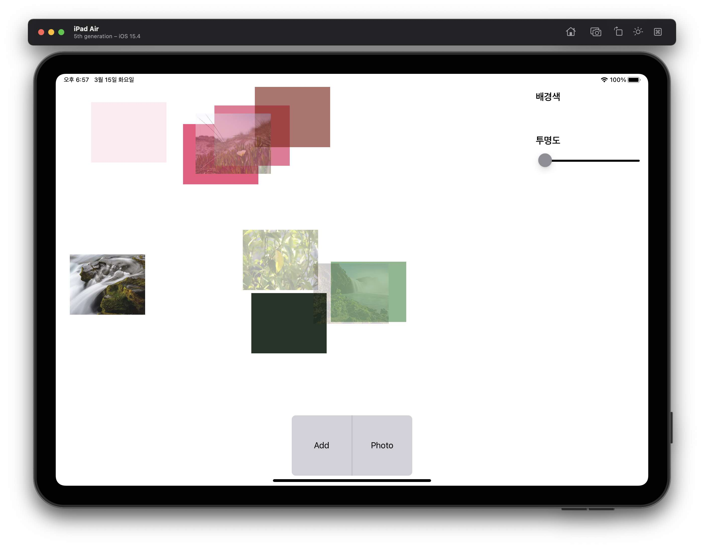

# swift-drawingapp

> 드로잉 앱 부터는 미리 README에 해야 할 일을 짜놓고 시작하기로 하였습니다.
> 작업부터 하고 README를 작성하고 있다보면 잊어버린 것을 발견하게 되어 버려서 아무래도 이 편이 나을 것 같습니다.

## Step1 - 아이패드 앱 프로젝트 ( 종료 시간 : 2022/03/01 17:00 )

### 학습 목표

```
MVC 구조를 학습한다.
View Factory 방식의 뷰 생성방식을 실습한다.
MVC 구조에 객체지향 프로그래밍 방식을 섞어 학습한다.
```

### 작업 목록

- [x] (Git) 저장소 fork 및 clone 후 작업 branch 생성

```View 구간:point_down:```

- [x] 사각형(뷰)을 만드는 모델을 생성한다. Class를 사용하고 Core Graphics나 UIKit을 임포트 하지 않는다.
- [x] CGSize/CGPoint를 사용하지 않고 Double타입을 기준으로 처리한다. Size/Point 타입을 선언해도 된다.
- [x] UIColor/CGColor를 사용하지 않고 RGB를 이용하여 처리한다.
- [x] 투명도를 1-10사이의 랜덤 값으로 표시한다.
- [x] CustomStringConvertible 프로토콜을 추가해본다.

```View Controller 구간:point_down:```

- [x] 사각형(뷰)을 뷰에 추가하는 뷰컨트롤러를 생성한다.
- [x] 모델을 생성할 때 랜덤값을 보내주는 팩토리 메소드를 생성한다. 모델은 랜덤값을 생성하지 않는다.

```View-View Controller 구간:point_down:```

- [x] View-ViewController 간의 관계가 명확히 드러나도록 구현한다.


### 추가로 진행한 사항
- [x] 접근제한자 처리
- [x] 객체 간 역할 분담
- [x] 테스트에 맞게 메소드 수정

### 추가 학습거리

#### iOS 앱을 구성하는 핵심 객체들과 iOS 메인 런루프 동작 이해하기 위해서 애플 UIKit 설명, App and Environment 문서를 학습한다.

iOS 앱을 개발하기 위한 필수 프레임워크인 ```UIKit framework```는 ```Core Object(핵심 객체)```를 제공합니다.   
핵셈 객체는 시스템이 화면의 컨텐츠들의 표시/상호작용/관리를 하기 위해 사용됩니다. 

앱 UIScene들의 LifeCycle 이벤트를 관리하고, 앱 실행 중 발생하는 특징적인 정보와 환경을 얻는 방법에 대해 학습합니다. iOS 13 이후부터는 사용자가 앱의 유저 인터페이스를 동시에 여러 개 만들 수 있습니다. 그리고, app switcher를 이용해 여러 앱을 바꿀 수 있습니다. iPad에서 사용자는 여러 개의 앱을 각 방향마다 여러 개 만들 수 있습니다. 각각의 UI는 같거나 다른 컨텐츠를 각각의 방식으로 보여줄 수 있습니다. 예를 들어, 사용자는 두 개의 캘린더 앱을 열어서 하나의 앱은 날짜를, 다른 하나의 앱은 월을 보여줄 수 있습니다.

UIKit은 현재의 환경을 Trait Collections를 통해 확인할 수 있습니다. Trait Collections들은 디바이스 셋팅, 인터페이스 셋팅, 사용자 셋팅을 모두 저장한 것입니다. 예를 들어, traits 를 이용하여 다크 모드가 현재 뷰 혹은 뷰 컨트롤러에 적용되어야 하는지 알 수 있습니다. 현재 UIView 혹은 UIViewController 객체의 Trait Collection을 이용해 현재 환경에 따라 앱을 커스터마이즈 하세요. UITraitEnvironment 프로토콜을 다른 객체에 적용하여 trait notification 변화를 수신하세요.

#### 프로토콜(Protocol) 역할과 표현 방식에 대해 학습한다.

프로토콜은 특정 타입들이 공통으로 가져야 할 협력 방식에 대해 정의하기 위해 선언합니다. 프로토콜이 있음으로 인해 프로토콜을 구현한 객체는 프로토콜에 선언된 프로퍼티나 함수를 가지고 있다는 것을 의미하고, 이는 프로토콜이 의미하는 역할을 수행 가능한 객체라는 의미합니다.

#### iOS13+ 이상에서 적용가능한 시스템 로그 함수를 학습한다.

> 출처는 아래와 같습니다.
> > [os_log](https://zeddios.tistory.com/979)
> > [\\[Swift\\] OSLog란? 그리고 StaticString은 뭘까?](https://leeari95.tistory.com/62)
> > [\\[iOS - swift] os_log, Logger, 통합 로깅 시스템(unified logging system)](https://ios-development.tistory.com/381)

흔히 '개발자만 볼 수 있는 print문' 이라고 표현되는 것 같습니다. 이 표현은 맞기도 하고 틀리기도 한데, 굳이 개발자가 아닌 이상 이런 로그를 볼 일은 없을 것 같습니다.

iOS에서 시스템에 로그를 관리하고, 이전의 로그를 열람하고 싶을 때 사용하는 것이 OSLog 프레임워크 입니다. ```Unified Logging System``` 으로 정의되는 이 프레임워크는 시스템의 메시징을 전역에서 캡처하는 API가 제공됩니다. 메시지(로그)는 디스크의 데이터 저장소에 모으게 됩니다. 여기서 로그의 레벨이 어떤 것이든 똑같이 활동할 수 있게 해주기 때문에 아주 유용하게 사용할 수 있는데 그 레벨은 아래와 같습니다. 해당 프레임워크 이전에는 ASL 혹은 Syslog API를 사용했다고 합니다.

| Level           | 디스크 저장 여부 | 내용                                                             |
|:----------------|:----------|:---------------------------------------------------------------|
| Default(notice) | Y         | 문제 해결을 위해 남기는 로그                                               |
| Info            | Y         | Error를 표현하고 싶은데, 에러 설명이나 문제 해결에 활용할 수 있어서 필수적이지는 않은 내용을 남기는 로그 |
| Debug           | N         | 개발 환경에서 사용하는 간단한 로그                                            |
| Error           | Y         | Info 중 활동 객체에 대한 프로세스 체인 정보를 캡처하는 로그                           |
| Fault           | Y         | 시스템 레벨, 다중 프로세스 오류 캡처를 위한 로그                                   |

OSLog를 사용하기 위해서는 프로젝트 파일의 현재 빌드하는 타겟을 선택(주로 테스트 타겟을 제외한 하나의 타겟을 선택)한 뒤 ```Build Phases```를 들어간다. ```Link Binary With Libraries```에서 프레임워크를 추가할 수 있는데, 여기서 ```OSLog.framework```를 찾는다. 어떠한 Xcode도 추가 설정 등은 계속 쉽게 할 수 있도록 발전중인 것 같다.


쓰는 방법은 아래와 같습니다. 이 문법은 ```import os.log``` 을 임포트 하였다는 것을 전제로 합니다.

```swift
os_log(.debug, "This is Debug Message")
```

이 내역은 Console.app 에서 확인 가능합니다.

아래는 특정 웹페이지에서 찾아낸 유틸 클래스인데, StaticString을 사용할 필요가 없어서 훌륭하다 생각되어 첨부합니다.

```swift
import Foundation
import os.log

// category 값을 정의
extension OSLog {
    static let subsystem = Bundle.main.bundleIdentifier!
    static let network = OSLog(subsystem: subsystem, category: "Network")
    static let debug = OSLog(subsystem: subsystem, category: "Debug")
    static let info = OSLog(subsystem: subsystem, category: "Info")
    static let error = OSLog(subsystem: subsystem, category: "Error")
}

// Property Wrapper로 사용하기 위한 Log 구현.
struct Log {
    enum Level {
        case debug
        case info
        case network
        case error
        case custom(categoryName: String)

        fileprivate var category: String { // category 이름을 반환하는 'categoryName' 변수
            switch self {
            case .debug:
                return "Debug"
            case .info:
                return "Info"
            case .network:
                return "Network"
            case .error:
                return "Error"
            case .custom(let categoryName):
                return categoryName
            }
        }

        fileprivate var osLog: OSLog { // Level에 따라 OSLog를 반환하는 변수
            switch self {
            case .debug:
                return OSLog.debug
            case .info:
                return OSLog.info
            case .network:
                return OSLog.network
            case .error:
                return OSLog.error
            case .custom:
                return OSLog.debug
            }
        }
        
        fileprivate var osLogType: OSLogType { // Level에 따라 OSLog.OSLogType을 반환하는 변수
            switch self {
            case .debug:
                return .debug
            case .info:
                return .info
            case .network:
                return .default
            case .error:
                return .error
            case .custom:
                return .debug
            }
        }
    }

    // Property Wrapper에서 실제 역할을 수행할 함수를 정의한다.
    static private func log(_ message: Any, _ arguments: [Any], level: Level) {
        if #available(iOS 14.0, *) {
            let extraMessage: String = arguments.map({ String(describing: $0) }).joined(separator: " ")
            let logger = Logger(subsystem: OSLog.subsystem, category: level.category)
            let logMessage = "\(message) \(extraMessage)"
            switch level {
            case .debug,
                 .custom:
                logger.debug("\(logMessage, privacy: .public)")
            case .info:
                logger.info("\(logMessage, privacy: .public)")
            case .network:
                logger.log("\(logMessage, privacy: .public)")
            case .error:
                logger.error("\(logMessage, privacy: .public)")
            }
        } else {
            let extraMessage: String = arguments.map({ String(describing: $0) }).joined(separator: " ")
            os_log("%{public}@", log: level.osLog, type: level.osLogType, "\(message) \(extraMessage)")
        }
    }
}

// MARK: - 실제 코드에서 사용할 유틸리티 메소드들.
extension Log {
    static func debug(_ message: Any, _ arguments: Any...) {
        log(message, arguments, level: .debug)
    }

    static func info(_ message: Any, _ arguments: Any...) {
        log(message, arguments, level: .info)
    }

    static func network(_ message: Any, _ arguments: Any...) {
        log(message, arguments, level: .network)
    }

    static func error(_ message: Any, _ arguments: Any...) {
        log(message, arguments, level: .network)
    }

    static func custom(category: String, _ message: Any, _ arguments: Any...) {
        log(message, arguments, level: .custom(categoryName: category))
    }
}

// 사용 예시
class ViewController: UIViewController {
    override func viewDidLoad() {
        super.viewDidLoad()
        let message = "This is Debug Message."
        Log.debug(message)
    }
}
```

---

## Step 1 Review & Update 1

- [x] 뷰를 만드는 것은 나중의 스텝이고, Step1 설명의 스크린 샷은 설명을 위한 참고자료임. view LifeCycle 메소드 중 viewDidLoad에서 값을 호출하도록 소스를 변경해야 합니다.
- [x] 모델인 ViewRandomProperty에 UIKit을 임포트 하거나, CGRect/CGSize같은 프로퍼티들이 보이고 있는데 이는 뷰 관련 내용들이 발견되었습니다.    
뷰 관련 순수 값만을 포함하는 모델을 작성하도록 수정이 필요합니다.
- [x] 모델에서 뷰 컨트롤러 혹은 뷰 컨트롤러의 프로퍼티를 참조하지 않고도 MVC Pattern 구현이 가능한데, 이는 코드의 유연성을 위한 것입니다.   
코드의 유연성을 위해서 모델과 뷰 컨트롤러를 분리하고, 델리게이트 패턴(프로토콜 사용) 등을 고려해봐야 합니다.
- [x] 불필요한 코드를 정리합니다.
- [x] Logger도 활용해봅니다.
- [x] 함수 이름 중 동사를 사용하는 것을 권장합니다.
- [x] Tuple + typealias 말고 구체적인 값 타입을 지정해보는 실습을 합니다. struct를 사용해봅니다.

---

## Step 2 - 속성 변경 동작

> 이제부터는 print() 함수를 쓰지 않을 것입니다.

* UIView의 redraw에 대해 이해하고 학습한다.
* struct와 class를 적절히 배치하여 사용한다.
* UITapGestureRecognizer에 대해 학습한다.
* 작업한 내용을 Unit Test 한다. (특히 Plane 구조체)

### 도전해볼만한 것들

* 만들어지는 뷰는 xib 파일로 만들어볼 수 있을지 확인해본다. 각각의 뷰가 제스쳐 인식기가 필요하다.   
_현재 만들어지는 뷰는 미리 설정해야 할 사항들을 모델이 모두 정의하고 있기 때문에 굳이 만들 이유가 없다고 판단하여 삭제합니다._
* @IBInspectable, @IBDesignable 을 실습해보고 스토리보드에서 직접 영향을 주는지 확인해보기.
* 다크모드(아주 중요하다고 생각)에서도 잘 보이도록 색 조합을 찾아보기.      
_공식문서에서는 **얇은 선에 어울리는** 약간 투명한 색이라고 정의하였으나, 다크모드에 대비한 색상으로도 적합하다고 생각하여   
view들의 border에 정의하였습니다.   
선택되어진 뷰 선택 시 나오는 선의 색깔은 Highlight 관련 색상으로 유용한 tintColor를 적용하였습니다._

### 구현 후 확인할 사항

- [x] 만들어진 사각형은 터치가 가능함.
- [x] 사각형이 터치 되면 선택상태라는 의미로, 사각형 테두리에 선을 표시한다. 빈 영역을 터치하면 선택해제된다.
- [x] 우측 컨트롤 패널로 속성(색상, 투명도) 조절이 가능한지 확인한다.
- [x] Plane 구조체가 다음의 역할 및 프로퍼티가 존재하는지 확인한다.
  * 추가한 사각형을 저장하는 변수
  * root view의 subviews index를 넘기면 사각형 모델을 반환하는 함수
  * 사각형 전체 개수를 알려주는 메소드
  * root view의 좌표를 넘기면 해당 위치에 사각형이 있는지 판단하는 함수

---

## Step 3 - Oberserver Pattern (완료: 2022.03.09 14:00)

* iOS MVC Pattern에서 Observer Pattern을 이용해 각 요소들끼리의 응집도를 향상시킨다.
* NotificationCenter에 대해 알아본다.

### 제약사항

* 생성된 사각형의 모델이 변할 때 NotificationCenter에 post하는 것은 Plane 모델이 한다.
* 모든 동작이 이전 스텝과 동일해야 한다.

### 고민해 볼 사항

1. ```Notification.Name``` 이것을 어떤 방식으로 설정해놓고 사용하면 좀 더 명확한 코드 작성이 가능할까?
2. Notification 객체를 만들 때 objecbt(Any), userInfo([AnyHashable:Any]) 두 개를 넣을 수 있다. object로도 다 할수 있는데 userInfo는 지양해야 하는가? 아니면 object를 지양하는 편이 좀 더 좋은가?

### 결과

<span>
    
    
    
</span>

이전 스텝과 동일한 작동을 합니다. 핵심객체 간 관계 및 협력방식을 아래와 같이 표현해보았습니다.



### 다양한 옵저버 등록 방식

NotificationCenter.default.addObserver 에서 옵저버와 Notification post가 매칭 되는 방식은 두 가지입니다.

* Notification.Name이 같은 경우
* Notification의 옵저버 등록 시 설정한 object 파라미터가 일치할 경우

addObserver 시 Name, Object는 모두 nil이 될 수 있습니다. 그러므로 post 시 `object가 같은 옵저버`와 `name이 같은 옵저버` 혹은 `name, object가 모두 일치하는 옵저버`로 Notification post와 Observer를 매칭시킬 수 있습니다.

참고로 Notification 생성자를 확인해보면 전부 Notification.Name을 필수로 넣어야 하는데, 이를 주의하여 옵저버 패턴을 작성해야겠다고 생각하였습니다.

---

### Step 3 Complement Tasks

* 델리게이트 메소드 규칙을 따르지 않는 RectangleViewTapDelegate 프로토콜의 ```changeCurrentSelect(at index: Int?)``` 를 수정합니다. 메소드명 자체는 좀 줄여볼 수 있음.(Naming+)[x]
* Plane 객체의 ```sendNotification(_:RectangleProperty, at:Int, as:MainScreenAction)``` 에서 생성하는 Notification post의 하드코딩 부분을 상수로 선언해본다.[x]
* Plane 객체의 addRectangle() 메소드 내 ```let factoryProperty: FactoryProperties```는 의미가 너무 광범위. 다른 이름으로 변경 필요.(Naming)[x]
* 바로 위와 같은 메소드에서 append 하는 property라는 단어 또한 광범위.[x]
* ```setRandomColor(at: Int)```는 이름이 애매함. return 이 있으면 get 이기도 한데 어딘가에 랜덤컬러를 넣는건지 반환하는건지 바꾸는건지 명확한 이름 선택 필요.(Naming)[x]
* ```addProperties(_: RectangleProperty)```는 여러 속성들을 한꺼번에 바꾼다는 뜻으로 해석되는데 실제는 그렇지 않음. 이름 변경 필요.(Naming)[x]
* MainScreenAction 타입은 Plane에 있을 필요가 있는지 고민 필요.(MVC)[x]
* RectRGBColor 에 propertyWrapper + init() 매개변수 타입 변경도 시도해보기.(OOP)[x]
* ```extension Notification.Name``` 를 전체적으로 선언하였는데 좀 더 관련이 깊은 타입에 확장하는 것이 좋음. 응집력이 떨어짐. (OOP)[x]
* MainScreenViewController의 ```observeMainScreenAction(using handler: @escaping (Notification) -> Void)```는 굳이 MainScreenViewController 소스코드와 분리할 필요가 없어 보임. (부연설명, OOP)[x]
* Notification 의 object는 매우 중요하므로 정확히 명시하는게 좋다. (Observer Pattern)[x]
* MainScreenViewController 에서 액션 별로 옵저버가 등록되는 것이 좋음.[x]
* MainScreenViewController 에서 터치한 뷰를 찾고, 프로퍼티를 변경하는 작업도 모델 기준으로 처리하도록 수정.[x]
* ViewController의 ```sliderAdmitAlphaValueChanged(_:UISlider)``` 메소드는 '(입력)뷰 컨트롤러 -> 모델, (출력)뷰 컨트롤러 변경' 을 하고 있는데 '(출력)뷰 컨트롤러 변경'은 따로 분리. 출력은 모델 -> 뷰 컨트롤러 -> 뷰 흐름을 가져야 한다.[x]

---

### Step 3 Complement Tasks 2

* Plane 객체의 addRectangle() 메소드에서는 재사용할 수 있는 값이 있을 것 같음.
* Delegate는 작동하는 방식의 의도가 담겨 있어야 한다. 델리게이트를 참조로 가진 변수가 단순히 delegate라는 이름만 가지는 것은 델리게이트 패턴을 제대로 활용하지 못하는 거고, 관련 메소드도 그 의도를 명확히 해야한다. 좀 더 고민 후 네이밍을 수정해보도록.
* MainViewController에서 plane을 직접 반영하는 부분들은 아쉬움. 좀 더 관계를 끊어보도록.

---

## Step 4 - Add Photo (완료: 2022.03.15 19:30)

### 추가할 기능

* 디바이스 사진 앨범에서 사진을 가져와서 추가할 수 있는 버튼을 Add 버튼 옆에 추가한다. (PhotoPicker 이용)
* 사진은 기존의 사각형과 동일하게 작동하지만, 배경색에 대해서는 인터페이스 제공하지 않는다.

### 앱이 요구하는 권한

현재는 필요한 권한인 NSPhotoLibraryUsageDescription 만 정의하였습니다.

1. NSPhotoLibraryAddUsageDescription(Privacy - Photo Library Additions Usage Description) = 사진 앱에 사진 등의 에셋을 추가하는 권한을 앱에 부여할 때 넣을 설명을 정의해둡니다.
2. NSPhotoLibraryUsageDescription(Privacy - Photo LibraryUsageDescription) = 사진 앱의 모든 에셋에 접근하고 사용하려 할 때 넣을 설명을 정의한다.

### PR Comment를 수정합니다(수정 완료: 2022.03.16 10:40).

* ```hasViewProperty```와 실제 뷰 프로퍼티인 이미지 데이터가 결국에는 ```MainViewController```, ```Plane 및 Plane이 관리하는 모델```, ```MainScreenViewController```의 결합을 강하게 만들고 있음. 옵저버를 사용하고 있다는 점을 고려하여 다시 코드를 작성.
* ```viewProperty: Any? = nil```는 너무 광범위한 의미를 포함한다. 다른 타입으로 처리해볼 수 있지는 않은지 고려해본다.
* ```MainSceneTapDelegate.didSelect()``` 에서 인덱스를 넘겨줄 경우 터무니 없는 값이 넘어올 수도 있다. Validation이 필요한 부분은 없는지 다시 한번 확인해본다.
* 특정 타입으로 변수를 선언하는 것과 변수를 선언해놓고 Down Casting 하는 것은 엄연히 다르다.   
```swift
var notificationInfo = [
  PostKey.index: rectangleModels.endIndex,
  PostKey.model: rectangleModel
] as [Plane.PostKey : Any] 
```
* ```RectangleRect```를 직역하자면 사각형사각 이다. 애매한 이름이다.

### 결과 화면



---

## Step 5 - Touch And Drag

### 목표

* UIGestureRecognizer를 정리하고 실제 구현합니다.
* UIGestureRecognizer 클래스가 어떻게 구체 클래스로 타입을 구체화시키는지 확인해본다.

### 구현 전략

* 각 이벤트에 대해 처리되는 기능을 타입으로 표현할 수 있도록 뷰를 확장해본다.
* 뷰에서 제스쳐 이벤트 발생 -> 뷰 컨트롤러 델리게이트 콜백 -> 모델 변화 -> 모델에서 뷰 컨트롤러에 뷰 변화 요청 -> 뷰 컨트롤러에서 뷰 변화 하는 MVC의 흐름을 따라 개발을 진행한다.
